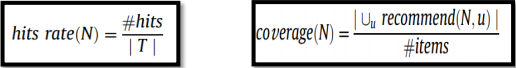
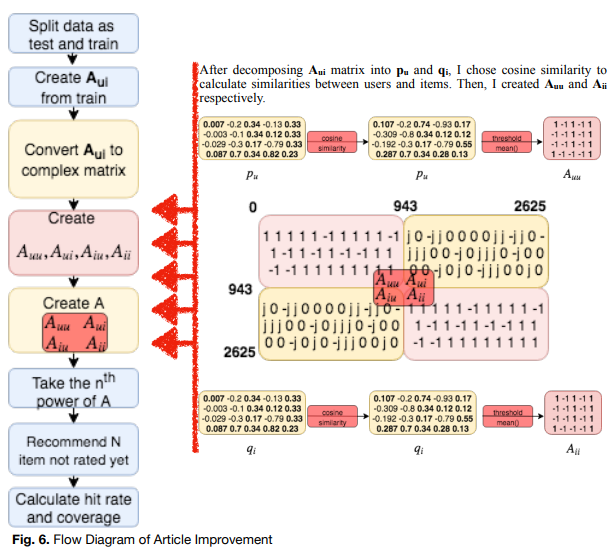

### Purpose
This repository is about implementation and improvement of the paper **[A link prediction approach for item recommendation with complex numbers](https://www.sciencedirect.com/science/article/abs/pii/S0950705115000568)**.

### Abstract
In the paper, recommendation problem is converted into a link prediction problem. They proposed a novel way for describing the relations "similar vs dissimilar and like vs. dislike" using complex numbers. This technique is called as **CORLP (Complex Representation-based Link Prediction)** and it is the technique which uses complex numbers to represent the like and dislike relations between users and items.

After describing the relations, they created **adjacency matrix A** in Figure 1. Then, they took the nth power (3,5,7,9) of A. Powered matrix contains the estimations. N (10, 20 ... 100) item which is not rated before the users is recommended to each user. Finally, they calculated the hits rate and coverage. 

  
   
  Figure 1. Adjacency Matrix A

As written in the paper, Auu and Aii matrices are intentionally left zero. Aui represents ratings to like(j) or dislike(-j), depending on the rating is less than the threshold. Aiu is equal to the transpose of Aui multiplied by -1.

For further improvement of the paper, Auu and Aii matrices will be taken account of by finding **Latent Factors (pu and qi)** of Aui. Then, Auu and Aii is created by applying cosine similarity to pu and qi respectively. After re-creating the matrix A, nth power of A are taken, hits rate and coverage are calculated.

### About Dataset ( [MovieLens 100k](http://files.grouplens.org/datasets/movielens/ml-100k-README.txt) | [Download](http://files.grouplens.org/datasets/movielens/ml-100k.zip) )

 MovieLens 100k dataset was collected during the seven-month period from September 19th, 1997 through April 22nd, 1998 by the GroupLens Research Project at the University of Minnesota. The dataset consists of 100,000 ratings from 943 users on 1682 movies. Those ratings are scaled 1-5. Furthermore, each user has rated at least 20 movies in the dataset. 
 
**u.data**, is full dataset randomly ordered and tab separated list of user id, item id, rating and timestamp, is considered. Also, Aui is created using u.data. 

### Terminology

**Latent Factor** is technique for matrix factorization. It is good for answer the "How to estimate missing rating?" question. With this technique, original matrix is divided by two matrices called **pu** and **qi**. Original matrix dimension is reduced and optimization, SGD (Stochastic Gradient Descent) process, can be done on it. So that, sparsity problem on the dataset is prevented.
  
**Hits rate** corresponds to ability to recommend relevant items to user. 
**Coverage**  corresponds to the percentage of items the system can recommend.

  
   
  Figure 2. Hits Rate and Formula

### Requirements

The implementation of CORLP method and further improvement of it are developed using Python programming language on Google Colab. 

  
   
  Table 1. Libraries used in Python

### Methodology 
|  | 
|:---:|:---:|
| CORLP | CORLP with Latent Factor | 

### (File Not Added Yet.) Comparison of Two Method 
Three different tests are conducted. 
**Test 1**: Adjacency Matrix is powered by 3, 5, 7, 9.  
**Test 2**: Threshold value for converting complex number were changed to 3, 4, 5. In this case, only A3 is considered. 
**Test 3**: Effect of different threshold value for cosine similarity was tested. Threshold is changed 0 to 0.5. 

Please, check **results.pdf** file for the test results.
 
### Developers  :computer:
- _Şafak Akıncı (@safak17)_ 
  _https://github.com/safak17_
- _Ahmet Gökçe Bozan (@gkca)_ 
  _https://www.github.com/gkca_
